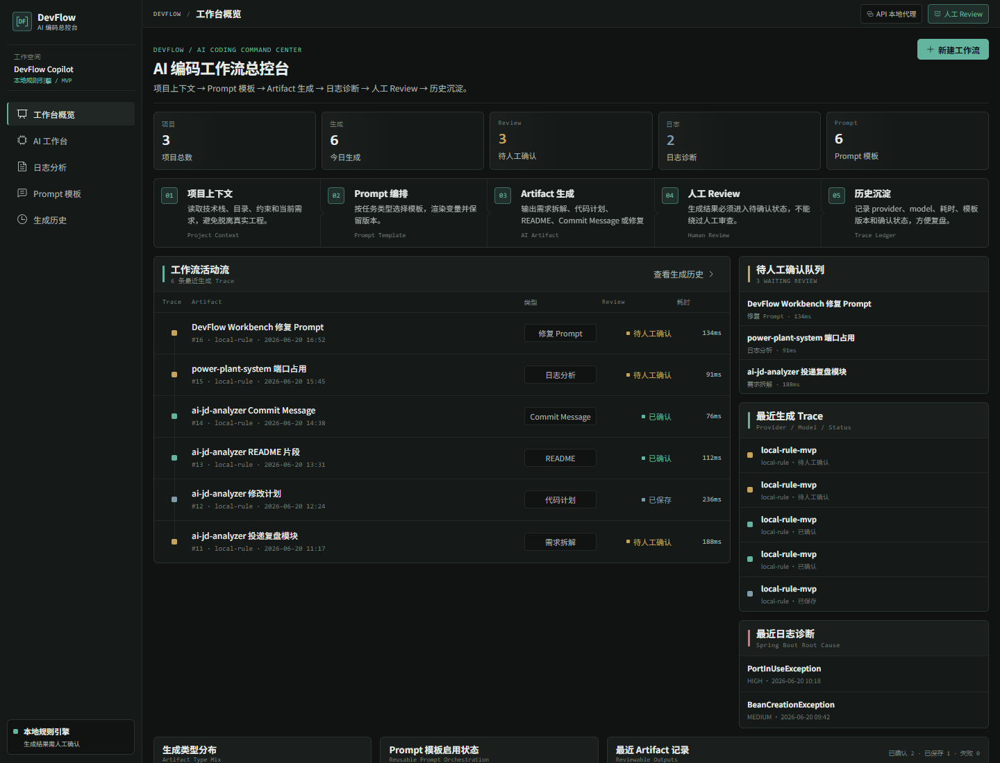
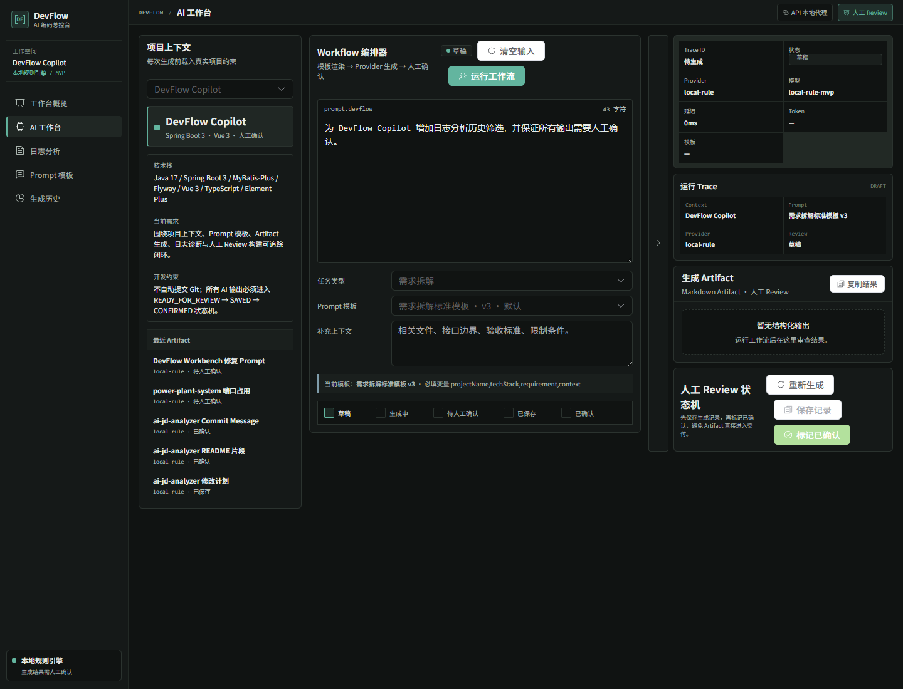
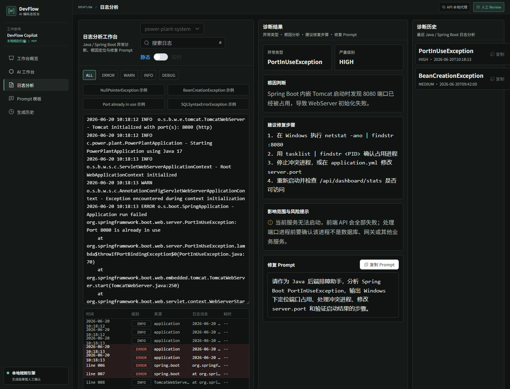
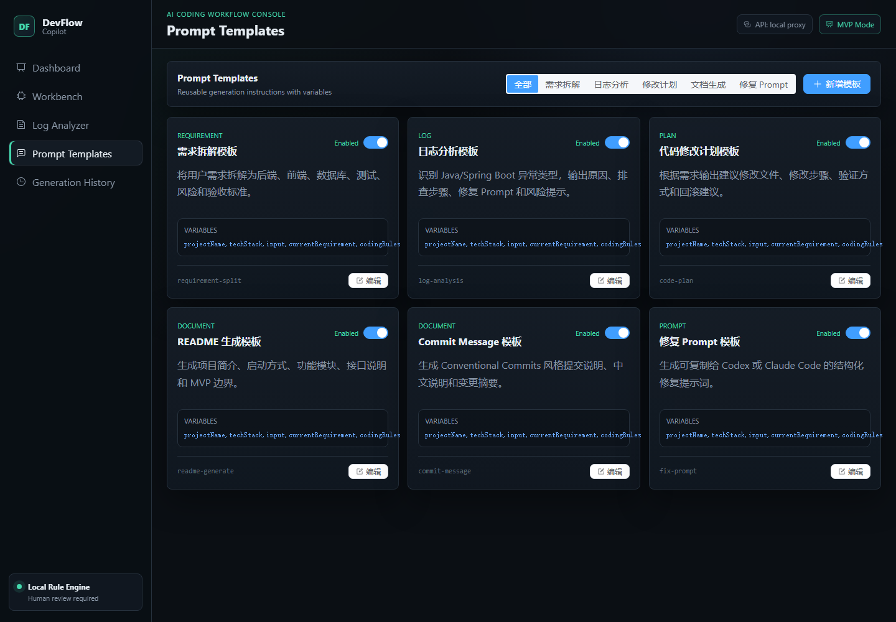
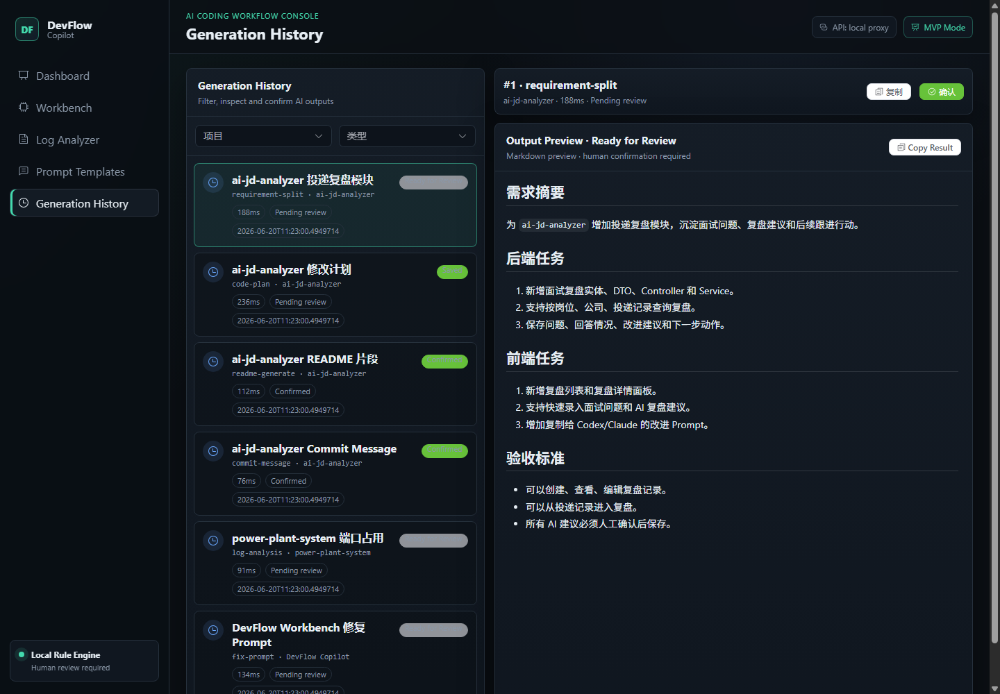
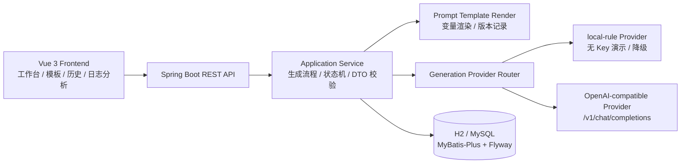

# DevFlow Copilot

DevFlow Copilot 是一个面向 Java 开发场景的 AI Coding 工作流控制台。它不是通用聊天页，而是把项目上下文、Prompt 模板、生成记录、日志诊断和人工确认流程组织成可追踪、可测试、可演示的工程化闭环。

项目默认使用 `local-rule` Provider，它是本地规则/模板生成，不是真实 LLM 推理，作用是在没有 API Key 的情况下稳定演示 Prompt 生成链路、状态流转、保存确认和历史记录。项目也提供 OpenAI-compatible Provider 的代码层适配，可对接兼容 `/v1/chat/completions` 的服务；当前仓库不提交真实 API Key，也不把真实模型端到端调用写成已稳定验收。

## 项目定位

- 面向对象：Java / Spring Boot 项目中的需求拆解、代码计划、README、Commit Message、修复 Prompt 与日志诊断场景。
- 核心思路：AI 生成结果必须进入生成历史，并经过 `READY_FOR_REVIEW → SAVED → CONFIRMED` 的人工确认状态机。
- 工程边界：当前是 MVP 级 AI Coding Console，不自动修改代码、不自动提交 Git、不包含登录权限、RAG 或 SSE 流式输出。

## 技术栈

| 层级 | 技术 |
| --- | --- |
| 后端 | Java 17、Spring Boot 3、MyBatis-Plus、Flyway、H2、MySQL、JUnit 5、MockMvc |
| 前端 | Vue 3、TypeScript、Vite、Element Plus、Axios、Markdown-it |
| AI 工程化 | OpenAI-compatible Provider 代码层适配、local-rule 本地模板生成、Prompt 模板变量渲染、生成状态机 |
| 工程与交付 | Docker Compose 配置与端口避让、Nginx、GitHub Actions |

## 项目截图

以下截图来自当前前端页面，主图按 1440px 宽度生成；大屏版本保存在 `docs/images/large/`。

### 工作台概览



### AI 工作台



### 日志分析



### Prompt 模板



### 生成历史



截图可通过前端脚本重新生成：

```bash
cd frontend
npm run screenshots
```

脚本会优先使用本地后端接口；如果后端未启动，会使用脚本内置 demo API 数据生成一致的前端展示截图。

## 核心功能

- 工作台概览：展示 AI 编码工作流状态、待人工确认队列、最近 Trace、日志诊断和 Prompt 模板状态。
- AI 工作台：基于项目上下文和 Prompt 模板生成需求拆解、代码修改计划、README、Commit Message、修复 Prompt 等 Artifact。
- 日志分析：基于关键词规则引擎识别常见 Java / Spring Boot 异常，例如 NullPointerException、SQLSyntaxErrorException、BeanCreationException、端口占用等，并输出排查步骤和修复 Prompt；当前不是 LLM 推理。
- Prompt 模板：管理模板类型、变量、版本、启用状态和默认模板。
- 生成历史：记录 provider、model、tokenUsage、latency、模板名称、模板版本、失败原因和状态；其中 local-rule 模式下 tokenUsage 是基于文本长度的估算值，不是真实 tokenizer 统计。
- 人工确认：约束生成结果从待人工确认到保存、确认，避免生成内容绕过 review 流程。

## 核心亮点

- Spring Boot 3 + Vue 3 前后端分离
- MyBatis-Plus 持久化
- H2/MySQL Profile
- Flyway 数据库迁移
- OpenAI-compatible Provider 代码层适配
- local-rule 本地模板生成演示
- Prompt 模板变量渲染和版本记录
- 生成状态机
- DTO 校验和全局异常处理
- JUnit 测试
- Docker Compose 配置与端口避让
- GitHub Actions

## 为什么适合写进大三实习简历

这个项目的价值不在于“套一个 AI 对话框”，而在于把 AI 生成链路做成了一个可解释的工程系统：有数据库持久化、有模板版本、有 Provider 抽象和降级、有状态机约束、有 DTO 校验、有异常处理、有测试和 CI。面试官可以从仓库直接看到后端分层、前端页面、数据迁移、测试覆盖和部署配置，比较适合作为大三阶段展示全栈工程能力和 AI 工程化意识的项目。

同时，项目边界写得比较清楚：没有实现的能力不会包装成已完成能力，例如没有在线 demo、没有 SSE 流式输出、没有声称稳定接入某个具体大模型平台。这种表达方式更适合实习面试，因为它能展示真实完成度和工程判断。

## 快速启动

### 后端启动

要求：Java 17、Maven。

```bash
cd backend
mvn spring-boot:run
```

默认使用 `dev` profile 和文件型 H2，数据保存在 `backend/data`。后端服务端口为 `8080`，H2 控制台地址为 `http://localhost:8080/h2-console`。

### 前端启动

要求：Node.js 18+。

```bash
cd frontend
npm install
npm run dev
```

前端开发地址为 `http://localhost:5173`，接口默认访问后端 `http://localhost:8080`。

### Docker Compose 启动

要求：已安装 Docker Desktop 或可用的 Docker Compose 环境。

```bash
docker compose up --build
```

Compose 定义 `mysql`、`backend`、`frontend` 三个服务。后端容器内部端口是 `8080`，当前宿主默认端口是 `18080`，对应配置为 `${BACKEND_HOST_PORT:-18080}:8080`；前端宿主端口为 `http://localhost:5173`，MySQL 暴露在 `localhost:3306`。

`docker compose config` 已通过；`docker compose up --build` 已尝试，但失败原因是 Docker Hub `registry-1.docker.io` 镜像元数据请求 `i/o timeout`。因此当前不能写成 Docker Compose runtime 已完整部署成功，准确状态是：Compose 配置与端口避让已完成，完整 runtime 启动待 Docker Hub 网络恢复后复验。

## 测试与验收结果

当前工程化验收结果：

- 后端：18 tests passed
- 前端：`npm run build` passed
- Docker Compose：`docker compose config` passed
- Docker runtime API smoke test：尚未完整完成，原因是 Docker Hub 镜像拉取/元数据请求超时
- 状态流转已验证：`READY_FOR_REVIEW → SAVED → CONFIRMED`
- 非法状态流转已验证：HTTP 409
- 参数校验已验证：HTTP 400

本地验证命令：

```bash
cd backend
mvn test

cd ../frontend
npm run build
```

关键覆盖点包括：Prompt 变量渲染、缺少变量校验、Provider 降级、生成记录持久化、状态机、Controller 参数校验、Mapper CRUD 和日志诊断规则。以上测试不等同于 Docker Compose runtime smoke test。

## 架构说明



更多说明见 [docs/architecture.md](docs/architecture.md) 和 [docs/interview-ready-project-summary.md](docs/interview-ready-project-summary.md)。

## LLM Provider 配置

默认无需 API Key：

```text
DEVFLOW_AI_PROVIDER=local-rule
```

`local-rule` 是本地规则/模板生成，用于无 API Key 时稳定演示生成链路，不是真实 LLM 推理。local-rule 模式下 tokenUsage 基于文本长度估算，不是真实 tokenizer 统计。

切换到 OpenAI-compatible 服务：

```text
DEVFLOW_AI_PROVIDER=openai-compatible
DEVFLOW_AI_BASE_URL=https://your-provider.example/v1
DEVFLOW_AI_API_KEY=your-key
DEVFLOW_AI_MODEL=your-model-name
DEVFLOW_AI_TIMEOUT_SECONDS=60
DEVFLOW_AI_MAX_TOKENS=2048
DEVFLOW_AI_FALLBACK_TO_LOCAL=true
```

API Key 只通过环境变量注入，不应写入代码或提交到仓库。OpenAI-compatible Provider 是代码层适配；当前仓库没有提交真实 API Key，也没有把真实模型端到端调用写成已稳定验收。真实 Provider 调用失败时，系统会按配置降级到 `local-rule`，并在生成记录的 `errorMessage` 中保留原因；如果 provider 返回 `usage` 字段，才可记录真实 token usage。

## H2 / MySQL Profile

开发环境默认使用 H2：

```text
SPRING_PROFILES_ACTIVE=dev
```

生产或 Docker 环境可使用 MySQL：

```text
SPRING_PROFILES_ACTIVE=prod
DB_URL=jdbc:mysql://localhost:3306/devflow_copilot?useUnicode=true&characterEncoding=utf8&serverTimezone=Asia/Shanghai&useSSL=false
DB_USERNAME=devflow
DB_PASSWORD=your-password
```

Flyway 迁移文件：

- `backend/src/main/resources/db/migration/V1__create_core_schema.sql`
- `backend/src/main/resources/db/migration/V2__seed_demo_data.sql`

## 主要 API

- `POST /api/projects`、`GET /api/projects`
- `POST /api/ai/requirement-split`
- `POST /api/ai/code-plan`
- `POST /api/ai/readme-generate`
- `POST /api/ai/commit-message`
- `POST /api/ai/fix-prompt`
- `POST /api/logs/analyze`
- `GET /api/prompts`
- `GET /api/generations`
- `GET /api/tasks?projectId={projectId}`：按项目查询 `ai_task` 列表，`projectId` 必填，返回 `ApiResponse<List<AiTask>>`
- `POST /api/generations/{id}/save`
- `POST /api/generations/{id}/confirm`

## 面试亮点

- 能说明为什么不是“AI 聊天套壳”：项目围绕 Prompt 模板、生成记录、状态机和人工确认构建工作流。
- 能说明 Provider 设计：默认 `local-rule` 用本地规则/模板保障演示闭环，OpenAI-compatible Provider 完成代码层适配，失败时可降级并记录错误原因。
- 能说明数据可信度：每次生成记录 provider、model、tokenUsage、latency、模板版本和状态；local-rule 的 tokenUsage 是估算值，真实 usage 依赖 OpenAI-compatible provider 返回。
- 能说明工程化能力：MyBatis-Plus、Flyway、H2/MySQL Profile、DTO 校验、全局异常处理、JUnit 测试、Docker Compose 配置与端口避让、GitHub Actions 配置都有实际落地。
- 能说明取舍：MVP 阶段没有做登录、RAG、SSE 或自动提交 Git，避免为了堆技术牺牲清晰边界。

## 相关文档

- [最终验收报告](docs/final-acceptance-report.md)
- [面试版项目说明](docs/interview-ready-project-summary.md)
- [简历描述建议](docs/resume-bullets.md)
- [架构说明](docs/architecture.md)
