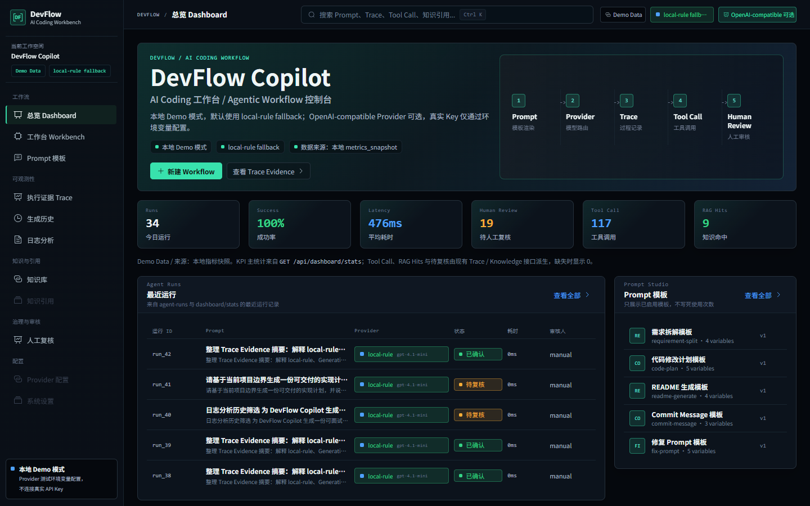
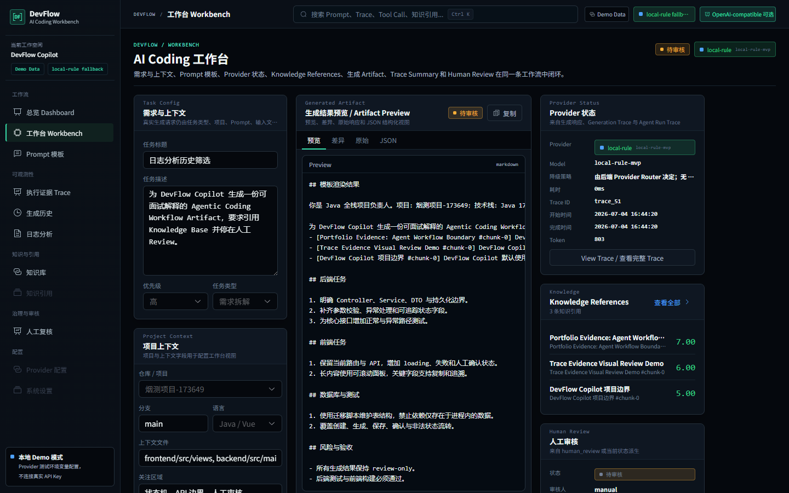
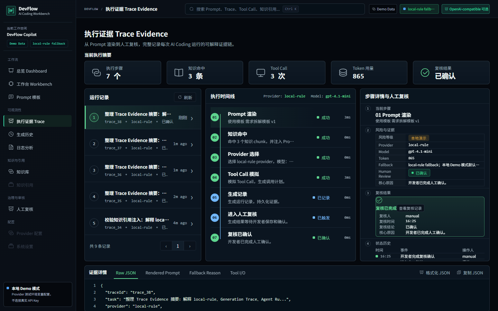
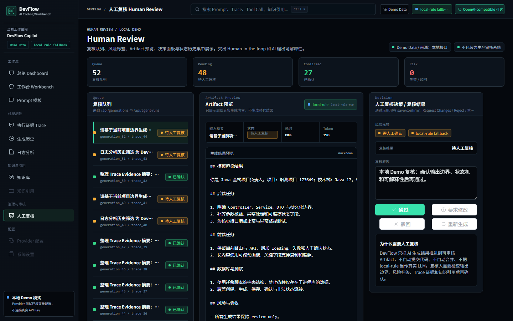

# DevFlow Copilot

Portfolio Case Study: [https://ai-agent-portfolio-hub.vercel.app/projects/devflow](https://ai-agent-portfolio-hub.vercel.app/projects/devflow)

DevFlow Copilot 是一个 AI Coding Workbench / Agentic Workflow Console，用于展示 Prompt、Provider、Trace、Tool Call 与 Human Review 的可解释 AI Coding 工作流。

它不是聊天套壳，也不是生产级大模型平台。当前版本用于 GitHub / 简历 / Boss 直聘作品集展示，重点呈现 Java 后端工程化、Vue 前端控制台、local-rule fallback、OpenAI-compatible Provider 代码层适配、Trace Evidence 和人工复核闭环。

## Screenshots

截图均来自本地真实运行页面，保存在 `docs/images/`，不使用聊天截图、第三方截图或 AI concept 图。

| Dashboard | Workbench |
| --- | --- |
|  |  |

| Trace Evidence | Human Review |
| --- | --- |
|  |  |

## Core Features

- Prompt 模板：支持模板变量、版本记录、渲染预览和生成请求关联。
- Provider 路由 / local-rule fallback：默认本地规则生成，无需 API Key；OpenAI-compatible Provider 为可选代码层适配。
- Trace Evidence：展示 Prompt 渲染、Provider 选择、Generation Trace、Agent Step、Tool Call、Fallback Reason 和 Human Review 证据链。
- Tool Call 记录：记录工具名、输入摘要、输出摘要、状态和耗时，用于解释一次 Agentic Workflow。
- Human Review：生成结果进入人工复核状态机，不自动改代码、不自动提交 Git。
- Knowledge References：轻量 Knowledge Base 关键词 / 简单相似度检索，并返回生成引用。
- Metrics Snapshot：通过脚本采集页面、路由、接口、测试、migration、截图和 build/test 状态。

## Tech Stack

| Area | Stack |
| --- | --- |
| Backend | Java 17, Spring Boot, Maven, MyBatis-Plus, Flyway |
| Frontend | Vue 3, TypeScript, Vite, Element Plus |
| Demo Data | H2 Demo, Flyway seed data |
| AI Workflow | Prompt Template, Provider Router, local-rule fallback, OpenAI-compatible optional provider |
| Evidence | Generation Trace, Agent Run Trace, Tool Call, Human Review, Knowledge References |
| Verification | JUnit 5, MockMvc, Playwright screenshot, `npm run build`, `mvn test` |

## Data Boundary

- 默认使用本地 Demo 数据。
- 默认使用 `local-rule fallback`，它是本地规则 / 模板生成，不是真实 LLM 推理。
- 默认不依赖真实 API Key。
- OpenAI-compatible Provider 可选，真实 Key 只应通过环境变量注入。
- 不声称生产级能力，不包含登录、多租户、SLA、限流、向量数据库或完整多 Agent Runtime。
- 不声称真实用户、线上收益、生产请求量或商业指标。
- 不自动修改代码、不自动提交 Git、不自动部署生产环境。
- `docs/design/references/` 是 AI-generated visual references，不是运行截图，也不作为 README 展示图来源。

## Metrics Snapshot

指标来自 [docs/metrics/metrics_snapshot.md](docs/metrics/metrics_snapshot.md)，由以下命令采集：

```bash
node scripts/collect-portfolio-metrics.js --run-checks
```

最近一次快照记录的可展示指标包括：

- 前端页面文件：8 个。
- 前端真实 component route：8 个，redirect route：1 个，disabled nav item：3 个。
- 后端 Controller：10 个，endpoint mapping：30 个。
- Flyway migration：4 个。
- 后端测试源码中的 `@Test`：20 个。
- `docs/images` 截图文件：13 张。
- `npm run build` 和 `mvn test` 的结果以本地最新快照和本轮验证为准。

不能从这些指标推导真实线上用户、生产流量、收益、SLA、真实 LLM 质量或 Lighthouse 分数。

## Local Run

后端：

```bash
cd backend
mvn spring-boot:run
```

前端：

```bash
cd frontend
npm install
npm run dev
```

默认本地开发地址：

- Frontend: `http://localhost:5173`
- Backend API: `http://localhost:8080`
- H2 Console: `http://localhost:8080/h2-console`

## Screenshots Regeneration

作品集截图脚本会连接本地后端 API，并从本地浏览器页面重新生成截图：

```bash
cd frontend
npm run screenshots:portfolio
```

canonical 输出：

- `docs/images/dashboard.png`
- `docs/images/workbench.png`
- `docs/images/trace-evidence.png`
- `docs/images/human-review.png`

## Verification

本轮作品集收口使用的验证命令：

```bash
cd frontend
npm run build

cd ../backend
mvn test

cd ..
node scripts/collect-portfolio-metrics.js --run-checks

cd frontend
npm run screenshots:portfolio

cd ..
git diff --check
```

## Main APIs

- `POST /api/ai/requirement-split`
- `POST /api/ai/code-plan`
- `POST /api/ai/readme-generate`
- `POST /api/ai/commit-message`
- `POST /api/ai/fix-prompt`
- `GET /api/generations`
- `POST /api/generations/{id}/save`
- `POST /api/generations/{id}/confirm`
- `GET /api/generation-traces?generationRecordId={id}`
- `GET /api/agent-runs`
- `GET /api/agent-runs/{id}/trace`
- `POST /api/knowledge/documents`
- `POST /api/knowledge/search`
- `GET /api/knowledge/references?generationRecordId={id}`

## Provider Configuration

默认无需 API Key：

```text
DEVFLOW_AI_PROVIDER=local-rule
```

OpenAI-compatible Provider 可选：

```text
DEVFLOW_AI_PROVIDER=openai-compatible
DEVFLOW_AI_BASE_URL=https://your-provider.example/v1
DEVFLOW_AI_API_KEY=<your-api-key>
DEVFLOW_AI_MODEL=your-model-name
DEVFLOW_AI_FALLBACK_TO_LOCAL=true
```

API Key 不应写入仓库。真实 Provider 调用失败时可按配置降级到 `local-rule`，并在生成记录中保留错误原因。

## Portfolio Notes

适合在简历中描述为：一个基于 Spring Boot + Vue 3 的 AI Coding Workbench MVP，将 Prompt 模板、Provider 路由、Trace Evidence、Tool Call、Knowledge References 与 Human Review 组织成可解释的 Agentic Workflow 控制台。

不建议描述为：生产级 AI SaaS、真实多 Agent Runtime、真实 LLM 质量评测平台、自动改代码系统、线上用户项目或商业化项目。

## Docs

- [架构说明](docs/architecture.md)
- [Metrics Snapshot](docs/metrics/metrics_snapshot.md)
- [简历证据与边界](docs/resume-evidence.md)
- [真实 Provider 验证步骤](docs/real-provider-verification.md)
- [Production Demo 部署指南](docs/deployment-production-demo.md)
