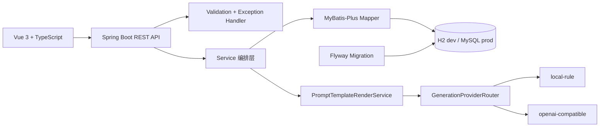
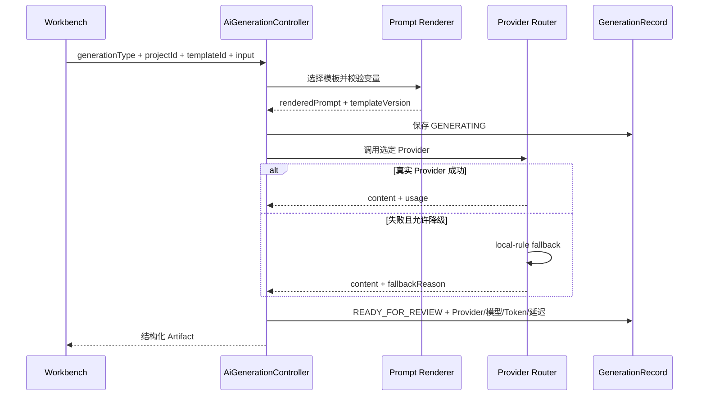
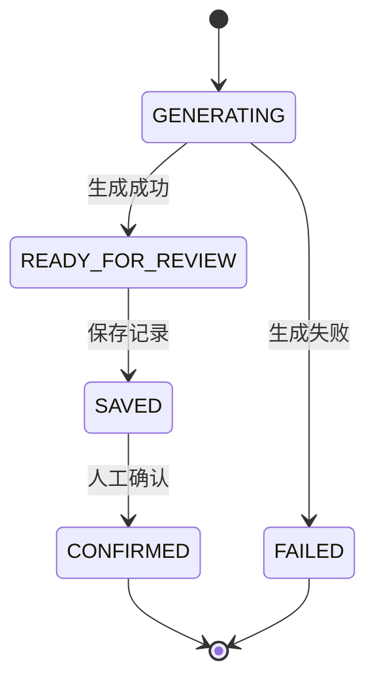

# DevFlow Copilot 架构

## 系统结构

## 生成流程

## 状态机

任何未列出的状态流转都会由后端拒绝。

## 数据库策略

- `dev`：文件型 H2，开箱即用并支持服务重启后保留数据。
- `test`：内存 H2，每次测试隔离执行。
- `prod`：MySQL 8，通过环境变量配置连接信息。
- Flyway migration 是正式表结构来源；Service 不再使用 `InMemoryStore` 作为主存储。

## 边界

当前没有实现 SSE、自动代码修改、Git 提交、RAG 和登录权限。OpenAI-compatible 适配已实现，但默认运行模式是无需 Key 的 local-rule。
