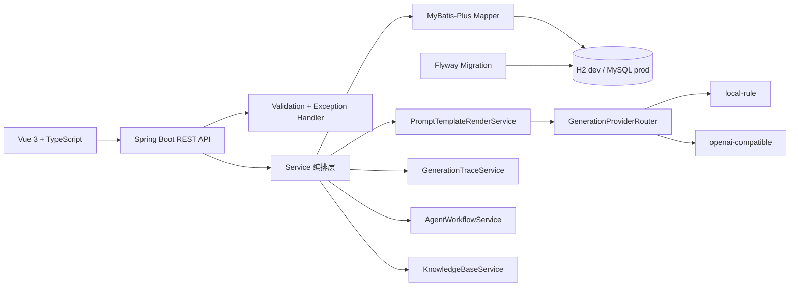
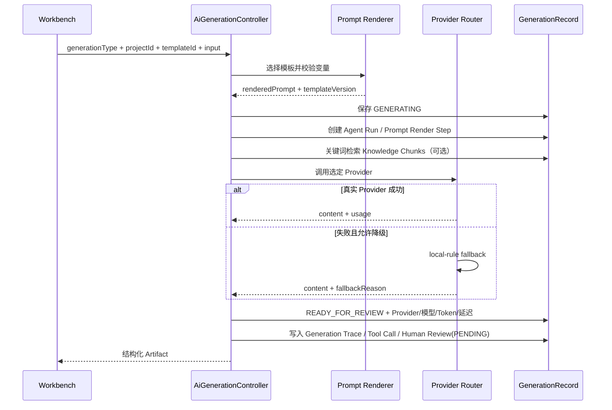
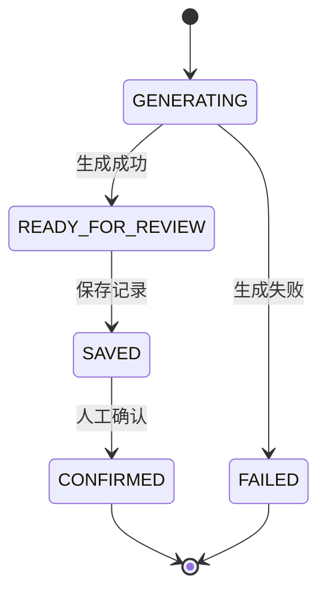

# DevFlow Copilot 架构

## 系统结构

## 生成流程

## Agent Workflow 记录

当前实现不是复杂多 Agent 调度 Runtime，而是可解释的 Agent Workflow 审计闭环：

- `agent_run`：一次生成任务运行，关联 `project_context` 和 `generation_record`。
- `agent_step`：记录任务接收、Prompt 渲染、Knowledge 检索、Provider 生成、人工确认等步骤。
- `tool_call_record`：记录工具名、输入摘要、输出摘要、状态和耗时，例如 `prompt-template-render`、`keyword-knowledge-search`、`generation-provider`。
- `human_review`：记录 PENDING、SAVED、CONFIRMED 或 REJECTED 状态；`generation_record` 从 `READY_FOR_REVIEW` 保存和确认时会同步更新。

查询接口：

- `GET /api/agent-runs`
- `GET /api/agent-runs/{id}/trace`

## Generation Trace

每次生成会写入 `generation_trace`：

- `prompt_version`
- `input_variables`
- `rendered_prompt_summary`
- `provider_name`
- `model_name`
- `status`
- `latency_ms`
- `error_message`

该表不保存 API Key；真实 Provider 的 Key 只通过环境变量进入运行时配置。

查询接口：

- `GET /api/generation-traces?generationRecordId={id}`
- `GET /api/generation-traces/{id}`

## Knowledge Base / 轻量 RAG

当前实现是无需外部服务的轻量检索闭环：

- `knowledge_document`：保存文档标题、来源、正文、chunk 数和 embedding 扩展字段。
- `knowledge_chunk`：保存切片文本、摘要、关键词、`embedding_model` 和 `embedding_vector` 预留字段。
- `generation_knowledge_reference`：保存一次生成命中的 chunk 引用、score、citation 和 snippet。

检索方式为关键词 / 简单相似度，不是向量数据库。生成请求可携带 `knowledgeQuery` 和 `knowledgeDocumentIds`，后端会把命中 chunk 注入 Prompt 上下文，并在响应中返回引用。

接口：

- `POST /api/knowledge/documents`
- `GET /api/knowledge/documents`
- `GET /api/knowledge/documents/{id}/chunks`
- `POST /api/knowledge/search`
- `GET /api/knowledge/references?generationRecordId={id}`

## 状态机

任何未列出的状态流转都会由后端拒绝。

## 数据库策略

- `dev`：文件型 H2，开箱即用并支持服务重启后保留数据。
- `test`：内存 H2，每次测试隔离执行。
- `prod`：MySQL 8，通过环境变量配置连接信息。
- Flyway migration 是正式表结构来源；Service 不再使用 `InMemoryStore` 作为主存储。

## 边界

当前没有实现 SSE、自动代码修改、Git 提交、登录权限、向量数据库和复杂多 Agent 调度。OpenAI-compatible 适配已实现，但默认运行模式是无需 Key 的 local-rule；轻量 Knowledge Base 已实现关键词检索、切片和生成引用。
