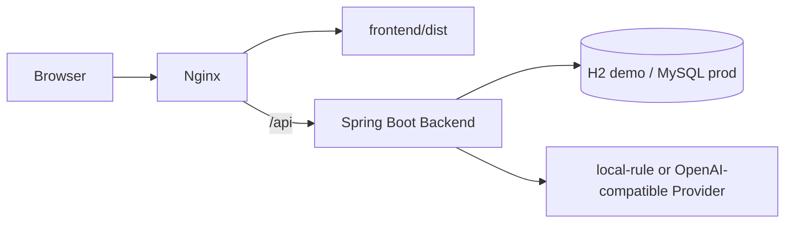

# DevFlow Copilot Production Demo 部署指南

本文面向作品集演示服务器部署，目标是让 DevFlow Copilot 作为 AI Coding / Agentic Workflow 控制台稳定展示。它不是生产级 SaaS 上线手册，也不承诺登录权限、多租户隔离、复杂多 Agent Runtime、自动代码修改或自动 Git 提交能力。

## 项目定位

DevFlow Copilot 是 AI Coding / Agentic Workflow 控制台作品集演示项目。它把 Prompt Studio、Provider 调用、Generation Trace、Agent Run Trace、Tool Call、Knowledge Base / RAG 引用和 Human Review 串成一个可解释、可截图、可面试说明的工程闭环。

## 部署边界

- 用途：portfolio demo / interview demo。
- 不是 production SaaS，不包含生产级账号、权限、多租户、审计合规或限流体系。
- 不在前端、README、`.env`、日志或截图中暴露 API Key。
- 不自动修改代码，不自动提交 Git，不替用户执行部署变更。
- 不实现完整多 Agent Runtime；当前是单次 Agent Workflow 的可观测记录闭环。
- Knowledge Base 当前是关键词 / 简单相似度检索和 RAG 引用，不是向量数据库。
- 默认可使用 `local-rule` fallback 演示，无需真实 Provider Key。

## 推荐部署架构



- Nginx 提供 `frontend/dist` 静态文件。
- Nginx 将 `/api/` 反向代理到 Spring Boot 后端。
- 后端通过服务器环境变量配置 Provider，不把 Key 写入仓库。
- 演示环境默认推荐 `DEVFLOW_AI_PROVIDER=local-rule` 或启用 `DEVFLOW_AI_FALLBACK_TO_LOCAL=true`。

## 服务器部署步骤

以下命令是示例流程，请根据服务器用户、目录和进程管理方式调整。不要把真实 Secret 写进 Git。

### 1. 拉取代码

```bash
git clone <your-repo-url> devflow-copilot
cd devflow-copilot
git checkout feat/frontend-design-system-foundation
```

### 2. 安装运行时

需要：

- Java 17
- Maven 3.9+
- Node.js 20+ 或 Node.js 18+
- Nginx
- 可选：MySQL 8

### 3. 后端测试与打包

```bash
cd backend
mvn test
mvn -DskipTests package
```

启动本地演示后端：

```bash
export SPRING_PROFILES_ACTIVE=dev
export DEVFLOW_AI_PROVIDER=local-rule
export DEVFLOW_AI_FALLBACK_TO_LOCAL=true
java -jar target/devflow-copilot-backend-0.0.1-SNAPSHOT.jar
```

使用 MySQL 的服务器演示：

```bash
export SPRING_PROFILES_ACTIVE=prod
export DB_URL='jdbc:mysql://127.0.0.1:3306/devflow_copilot?useUnicode=true&characterEncoding=utf8&serverTimezone=Asia/Shanghai&useSSL=false'
export DB_USERNAME='devflow'
export DB_PASSWORD='<set-on-server-only>'
export DEVFLOW_AI_PROVIDER=local-rule
export DEVFLOW_AI_FALLBACK_TO_LOCAL=true
java -jar target/devflow-copilot-backend-0.0.1-SNAPSHOT.jar
```

### 4. 前端构建

```bash
cd ../frontend
npm install
npm run build
```

将 `frontend/dist` 放到 Nginx 静态目录。示例配置见 [docs/nginx/devflow-demo.conf.example](nginx/devflow-demo.conf.example)。

### 5. Nginx 配置

核心要求：

- `root` 指向前端 `dist`。
- SPA 路由使用 `try_files $uri $uri/ /index.html;`。
- `/api/` 反代到 Spring Boot，例如 `http://127.0.0.1:8080/api/`。
- TLS 证书路径、真实域名、服务器 IP 均由服务器本地配置，不写入仓库。

### 6. 进程管理

作品集演示可用 systemd、tmux、screen、Docker Compose 或云平台进程管理。仓库不提供自动部署脚本，也不会自动写入真实环境变量。

## 环境变量说明

基础后端变量：

```text
SPRING_PROFILES_ACTIVE=dev
SERVER_PORT=8080
DB_URL=
DB_USERNAME=
DB_PASSWORD=
```

Provider 变量：

```text
DEVFLOW_AI_PROVIDER=local-rule
DEVFLOW_AI_BASE_URL=
DEVFLOW_AI_MODEL=local-rule-mvp
DEVFLOW_AI_API_KEY=
DEVFLOW_AI_FALLBACK_TO_LOCAL=true
```

说明：

- `DEVFLOW_AI_PROVIDER=local-rule`：无 Key 演示，适合公开作品集。
- `DEVFLOW_AI_PROVIDER=openai-compatible`：使用兼容 `/v1/chat/completions` 的真实 Provider。
- `DEVFLOW_AI_BASE_URL`：真实 Provider base URL，只在服务器环境变量中配置。
- `DEVFLOW_AI_MODEL`：模型名；local-rule 演示可使用 `local-rule-mvp`。
- `DEVFLOW_AI_API_KEY`：只放服务器环境变量或 Secret Manager，不写入仓库。
- `DEVFLOW_AI_FALLBACK_TO_LOCAL=true`：真实 Provider 失败时回退到 local-rule，避免公开 demo 完全不可用。

安全模板见 [docs/env.example](env.example)。

## 安全说明

- API Key 只放服务器环境变量、进程管理器环境或云平台 Secret Manager。
- 不把真实 Key 写入 README、`.env`、`docs/`、前端代码、测试代码、截图脚本或日志。
- 不提交 `.env`、`.env.*`、`node_modules/`、`frontend/dist/`、`backend/target/`、日志文件。
- Nginx 配置示例只使用占位域名和占位路径，不包含真实证书路径。
- 前端代码只请求 `/api`，真实 Provider Key 不会进入浏览器。
- Generation Trace 和 Agent Run Trace 记录 provider、model、status、latency 和错误摘要，不应记录 Authorization Header 或 API Key。

## 验收 checklist

部署前：

- [ ] `cd backend && mvn test` 通过。
- [ ] `cd backend && mvn -DskipTests package` 成功生成 jar。
- [ ] `cd frontend && npm install && npm run build` 通过。
- [ ] 密钥扫描通过，没有真实 API Key、私钥、`.env` 或日志文件进入 Git。
- [ ] `docs/images/` 作为真实浏览器截图目录，README 不把 `docs/design/references/` 当主截图。

服务启动后：

- [ ] `/` 页面可访问。
- [ ] `/workbench` 页面可访问。
- [ ] `/agent-runs` 页面可访问。
- [ ] `/knowledge` 页面可访问。
- [ ] `/prompts` 页面可访问。
- [ ] `/api/dashboard/stats` 可访问，并返回统一 `ApiResponse`；当前项目没有独立 `/api/health`。
- [ ] Workbench 可以在 local-rule fallback 下完成一次 review-only 生成。
- [ ] Generation Trace / Agent Run Trace / Human Review 页面能看到真实记录。

## 部署后说明口径

对外展示时建议说明：

- 这是作品集演示项目，不是生产级 SaaS。
- 默认演示走 local-rule，真实 Provider 只通过服务器环境变量配置。
- Knowledge Base 当前是关键词检索 / RAG 引用，不是向量数据库。
- Agent Run Trace 是可解释工作流记录，不是完整多 Agent 调度系统。
- 所有 AI 输出仍需人工 Review，不自动修改代码或提交 Git。
